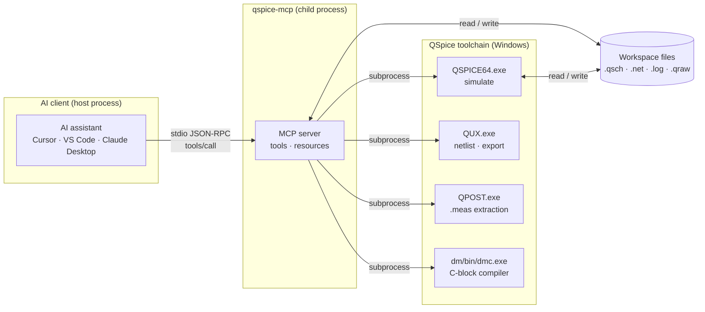
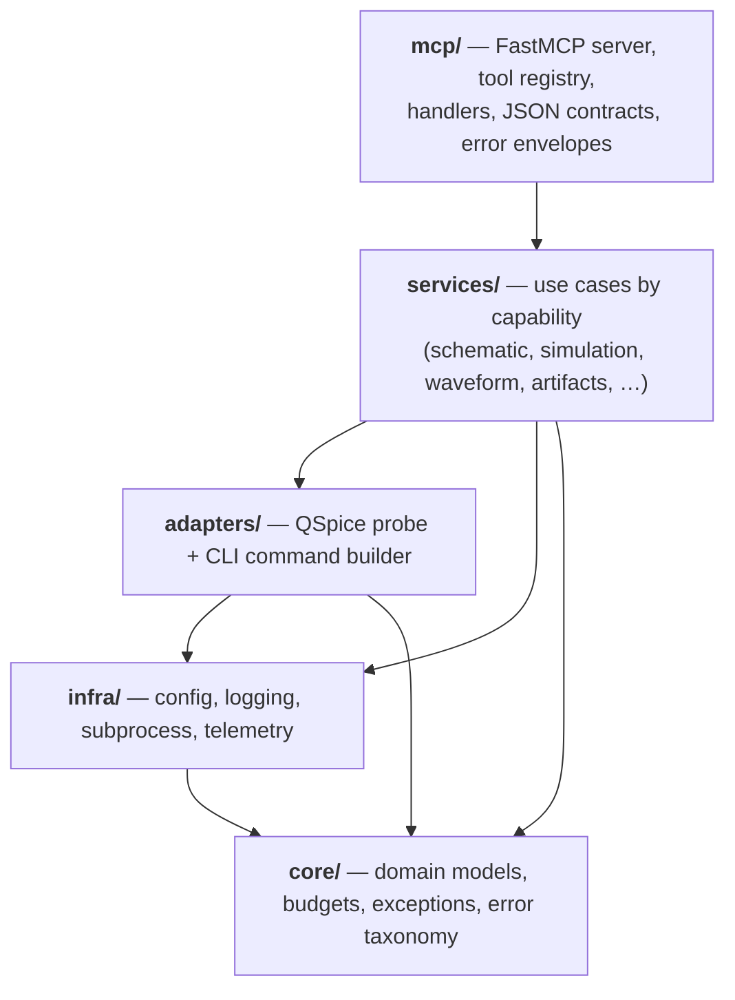
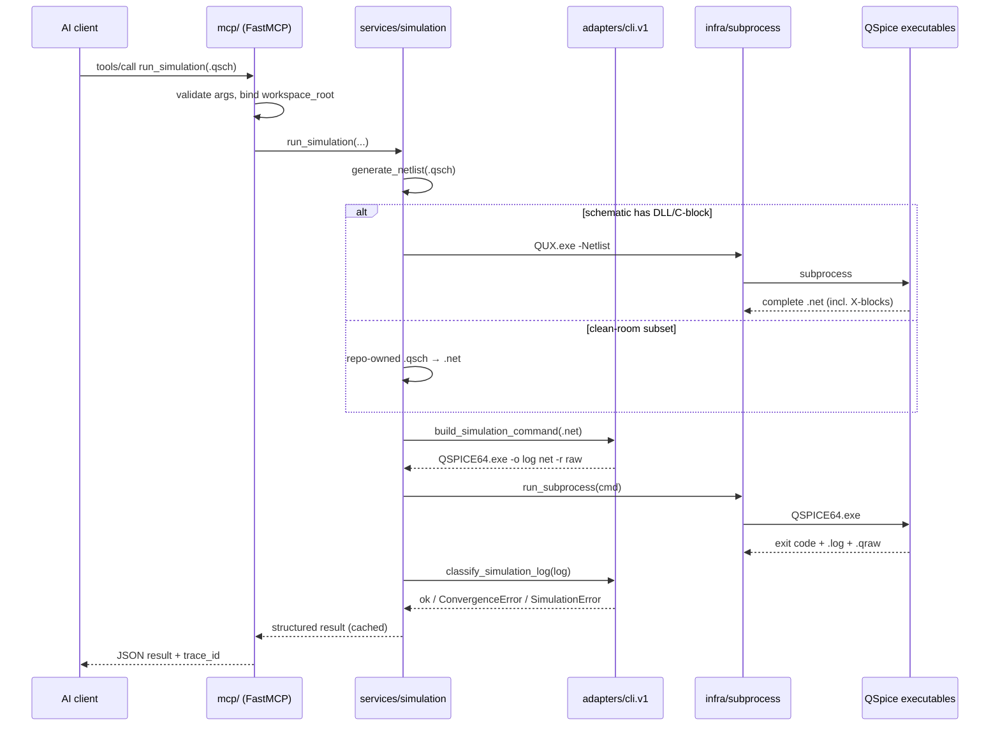
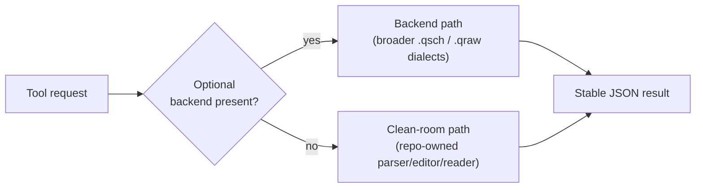

# Architecture

> **Users:** see the [User guide](user-guide.md) for install, workflows, and troubleshooting.
> **Contributors:** implementation layout and extension steps are in `.cursor/rules/qspice-development.mdc`.

`qspice-mcp` is a local [Model Context Protocol](https://modelcontextprotocol.io) (MCP) server that lets an AI assistant drive the **QSpice** circuit simulator through a stable, typed tool surface. The AI never touches QSpice directly — it sends tool calls, and the server turns them into safe, validated simulator operations and compact JSON results.

---

## 1. System context

The server runs as a child process of the AI client and speaks **MCP over stdio** (newline-delimited JSON-RPC on stdin/stdout). It launches the QSpice executables as short-lived subprocesses and operates only on files inside a configured workspace.

**Key properties**

- **Transport:** stdio by default (`--transport stdio`); SSE is also selectable. The client spawns the server — it is not a long-running shell.
- **Source of truth:** the `.qsch` schematic. `.net`, `.log`, and `.qraw` are derived artifacts.
- **Confinement:** every path is validated against the configured `--workspace-root`.

---

## 2. Layered design

The codebase is organized into five layers with a strict **inward-only** dependency rule: outer layers depend on inner layers, never the reverse. `core` is pure and has no I/O.

| Layer | Responsibility | Notably does **not** |
| --- | --- | --- |
| `mcp/` | FastMCP bootstrap, tool registration, argument validation, mapping domain results/errors into stable MCP JSON (with `error_code` + `trace_id`). | Own subprocess calls or parse simulator formats. |
| `services/` | One module per capability implementing the use case: schematic edits, netlist generation, simulation, sweeps/batches, waveform reads, exports, device scaffolding. Owns the clean-room `.qsch` editor and orchestration. | Speak the MCP wire protocol. |
| `adapters/` | Discover the QSpice executable (`probe.py`), select an adapter (`registry.py`), and build the simulation command + classify log failures (`cli/qspice_v1.py`, key `cli.v1`). | Decide product workflow or hold business logic. |
| `infra/` | Cross-cutting plumbing: settings/env (`config.py`), structured logging, the `run_subprocess` wrapper, and telemetry. | Know about QSpice semantics. |
| `core/` | Pure domain: data models, `DataBudget` limits, the `QSpiceError` hierarchy, and the stable error-code taxonomy. | Perform any I/O. |

---

## 3. How a request flows

Below is the end-to-end path for the most representative call, `run_simulation` on a `.qsch` that contains a C-block (DLL) device.

Notes that make this accurate:

- **Netlist generation** prefers the companion `QUX.exe -Netlist` when the schematic contains DLL/C-block components (the clean-room parser intentionally omits them); otherwise it uses the repo-owned clean-room renderer, falling back to an optional editor backend.
- **Command construction lives in the adapter** (`cli.v1`): it owns the `-o`/`-r` output switches, rejects reserved or path-like `extra_switches`, and turns ambiguous log lines into typed `ConvergenceError`/`SimulationError`.
- **Execution lives in `infra`**: a single `run_subprocess` wrapper runs every executable, captures stdout/stderr/exit code/duration, and enforces timeouts.
- **Results are cached** keyed on the netlist plus CLI switches, so repeated identical runs return immediately.

---

## 4. Talking to QSpice

QSpice ships several cooperating executables. The server discovers them next to the configured `QSPICE64.exe` and uses each for a specific job.

| Executable | Used for | Invoked by |
| --- | --- | --- |
| `QSPICE64.exe` | Run the simulation (`-o log netlist [-r raw] [-ASCII]`) | `adapters/cli.v1` builds the command; `infra` runs it |
| `QUX.exe` | Generate full netlists (`-Netlist`), export waveforms (`-Export … CSV/ASCII/SPICE/S2P`), emit DLL variables (`-DLLvariables`) | `services/_internals/qux.py` |
| `QPOST.exe` | Refresh `.meas` measurement output for `read_log` / `read_measures` | `services/waveform/read_log.py` |
| `dm/bin/dmc.exe` | Compile C-block `.cpp` sources into custom-device DLLs (bundled Digital Mars C++) | `services/mixed_signal/build_dll_device.py` |

**Discovery & probing.** `adapters/probe.py` resolves the executable from the configured path → default Windows install locations → `PATH`, then detects the version using the fastest reliable strategy first (PE file metadata on Windows, then a short `--version` CLI probe, then file timestamp). Companions are located with `executable.with_name("QUX.exe")` etc., so a standard QSpice install "just works."

---

## 5. Clean-room core vs. optional backends

The base install is fully usable with **no third-party EDA libraries**. Richer behavior is opt-in via the `[backends]` extra.

- **Clean-room** code (`services/_backends/_qsch_editor.py`, the `.qraw` reader/writer, the netlist renderer) is repo-owned and GPL-safe — it copies no third-party simulator code.
- **Degradations are explicit:** `describe_server_capabilities` reports which backends are active and which tool groups are degraded, so an AI client can adapt at runtime instead of failing blindly.

---

## 6. Cross-cutting concerns

| Concern | Where | Behavior |
| --- | --- | --- |
| **Stable errors** | `core` taxonomy → surfaced by `mcp` | Domain `QSpiceError`s carry a stable `error_code` (see [errors.md](errors.md)); the MCP layer wraps them into structured error envelopes with `error_code` and `trace_id`. |
| **Output budgets** | `core` `DataBudget` | `read_waveform` is capped (2000 points / 64000 bytes); larger data is routed to plots, CSV, or derived raws. |
| **Caching** | `services/simulation` | Successful runs are cached on netlist + switches; stale sibling `.net` is refreshed when the schematic is newer. |
| **Security** | `services` path helpers + `adapters` | Workspace-confined paths, suffix checks, reserved-switch rejection, and transactional artifact writes (see [security.md](security.md)). |
| **Observability** | `infra` | Structured logs, a per-response `trace_id`, and optional OpenTelemetry spans (`[telemetry]`). |

---

## 7. Extension points

Adding a capability follows the inward-only grain:

1. Add a service module + `SERVICE_SPEC` under `services/<group>/`.
2. Keep logic in the service (and `_internals/`); add optional glue in `_backends/` only when a richer path exists.
3. Register MCP metadata in `mcp/_tool_metadata/` and a handler in `mcp/tools/`.
4. Cover it with unit tests; reserve integration tests for cases that require a real QSpice.

The implemented surface is enumerated in the [Tool reference](tool_reference.md); call `describe_server_capabilities` at runtime for the live backend, feature-flag, and error-taxonomy state.

## Open engineering gaps

- Broader clean-room `.qsch` authoring and inspection coverage.
- Richer live-GUI bidirectional cross-probing.
- Wider repo-owned `.qraw` compatibility beyond the current supported slices.
